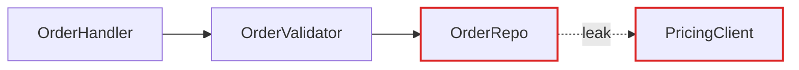
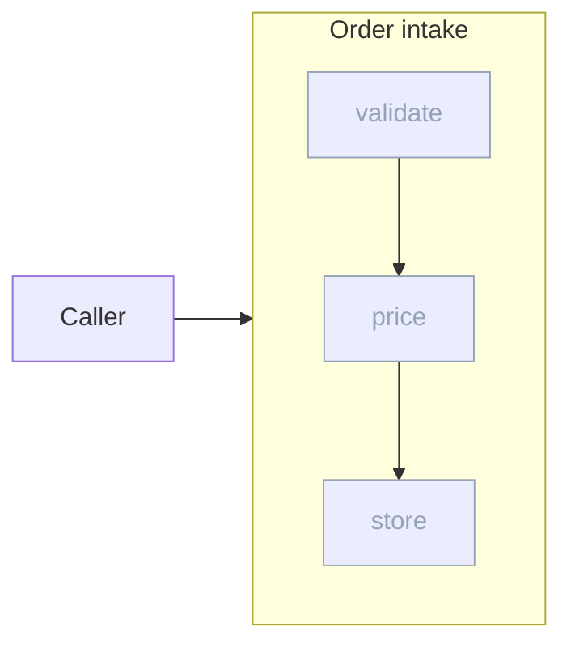

# Report format

The architectural review is written inline in the reply as Markdown. Mermaid fences handle graph-shaped diagrams reliably; tables and short lists handle the more editorial visuals (mass diagrams, cross-sections). Mix the two: don't lean on Mermaid for everything, it'll start to look generic.

## Scaffold

```markdown
# Architecture review for {{repo name}}

Legend: box = module, dashed edge = seam, `leak` edge = leakage, thick box = deep module.

## Candidates

### 1. {{Collapse the Order intake pipeline}}
...

## Top recommendation
...
```

## Header

Repo name, date, and a compact legend on one line. No introduction paragraph. Straight into the candidates.

## Candidate card

The diagrams carry the weight. Prose is sparse, plain, and uses the glossary terms (from the `/codebase-design` skill) without ceremony.

Each candidate is one `###` section:

- **Title**: short, names the deepening (e.g. "Collapse the Order intake pipeline").
- **Badge row**: one line, recommendation strength (`Strong`, `Worth exploring`, `Speculative`) plus a tag for the dependency category (`in-process`, `local-substitutable`, `ports & adapters`, `mock`).
- **Files**: a list in backticks.
- **Before / After diagram**: the centrepiece. Two fences, `**Before**` then `**After**`, each followed by a `Figure:` line stating the one thing it shows. See patterns below.
- **Problem**: one sentence. What hurts.
- **Solution**: one sentence. What changes.
- **Wins**: bullets, ≤6 words each. e.g. "Tests hit one interface", "Pricing logic stops leaking", "Delete 4 shallow wrappers".
- **ADR callout** (if applicable): one line as a blockquote.

No paragraphs of explanation. If the diagram needs a paragraph to be understood, redraw the diagram.

## Diagram patterns

Pick the pattern that fits the candidate. Mix them. Don't make every diagram look the same. Variety is part of the point. Quote any label holding `:`, `(`, `[`, `|`, or `/`.

### Mermaid flowchart (the workhorse for dependencies / call flow)

Use a `flowchart` when the point is "X calls Y calls Z, and look at the mess." Style with `classDef` to mark leakage edges and the deep module. Sequence diagrams work well for "before: 6 round-trips; after: 1."

````markdown

Figure: pricing leaks across the repo seam.
````

### Deep module with faded internals (when the "after" is one thick box)

A `subgraph` is the deep module; its internals sit inside it, tagged with a faded `classDef`. Reach for this when you want the "after" to read as one interface with the wrappers absorbed behind it.

````markdown

Figure: one interface, three now-internal calls.
````

### Cross-section (good for layered shallowness)

A one-column table, one row per layer a call passes through. Before: 6 thin rows each doing nothing. After: 1 row labelled with the consolidated responsibility.

### Mass diagram (good for "interface as wide as implementation")

A two-column table per module: interface surface (number of exported symbols) against implementation size (lines or functions). Before: the two numbers are nearly equal (shallow). After: interface small, implementation large (deep).

### Call-graph collapse

Before: a `flowchart TB` tree of function calls. After: the same tree as one node, with the now-internal calls listed faded inside a `subgraph`.

## Top recommendation section

One short section. Candidate name, one sentence on why, a link to its heading. That's it.

## Tone

Plain English, concise, but the architectural nouns and verbs come straight from the `/codebase-design` skill. Concision is not an excuse to drift.

**Use exactly:** module, interface, implementation, depth, deep, shallow, seam, adapter, leverage, locality.

**Never substitute:** component, service, unit (for module) · API, signature (for interface) · boundary (for seam) · layer, wrapper (for module, when you mean module).

**Phrasings that fit the style:**

- "Order intake module is shallow: interface nearly matches the implementation."
- "Pricing leaks across the seam."
- "Deepen: one interface, one place to test."
- "Two adapters justify the seam: HTTP in prod, in-memory in tests."

**Wins bullets** name the gain in glossary terms: *"locality: bugs concentrate in one module"*, *"leverage: one interface, N call sites"*, *"interface shrinks; implementation absorbs the wrappers"*. Don't write *"easier to maintain"* or *"cleaner code"*, because those terms aren't in the glossary and don't earn their place.

No hedging, no throat-clearing, no "it's worth noting that…". If a sentence could be a bullet, make it a bullet. If a bullet could be cut, cut it. If a term isn't in the `/codebase-design` glossary, reach for one that is before inventing a new one.
