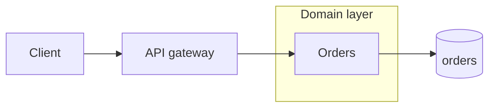
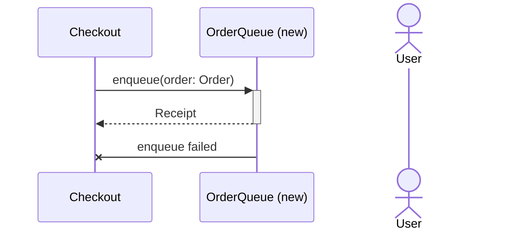
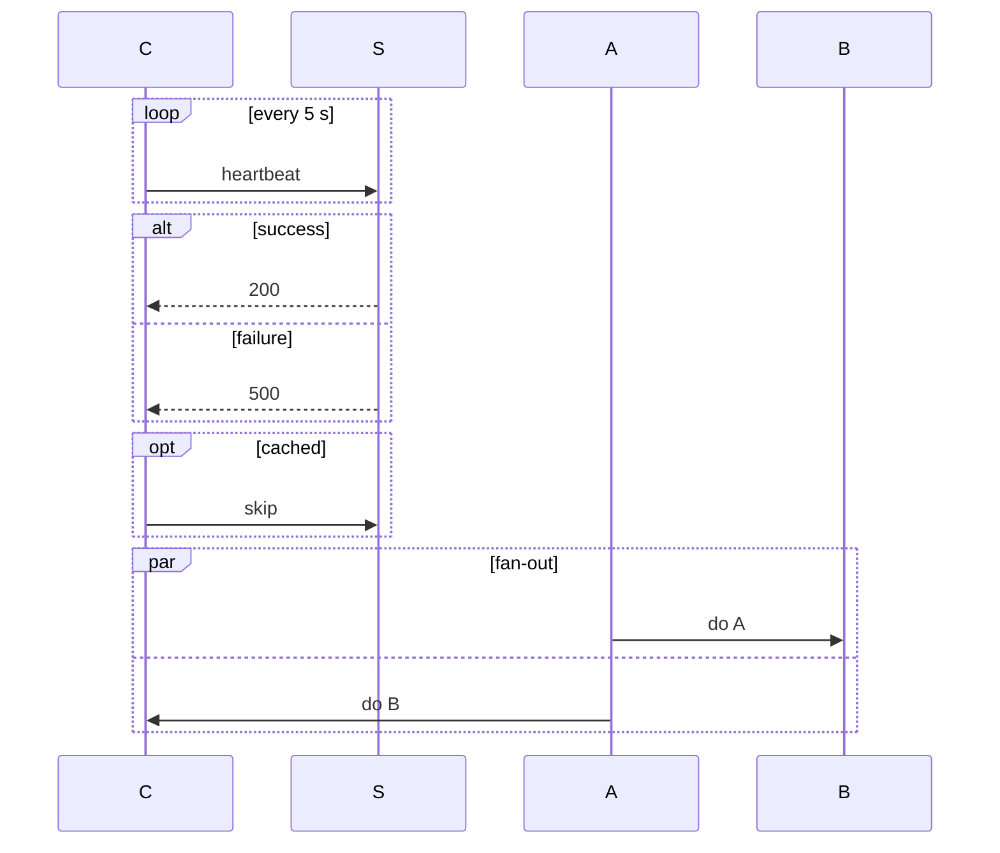
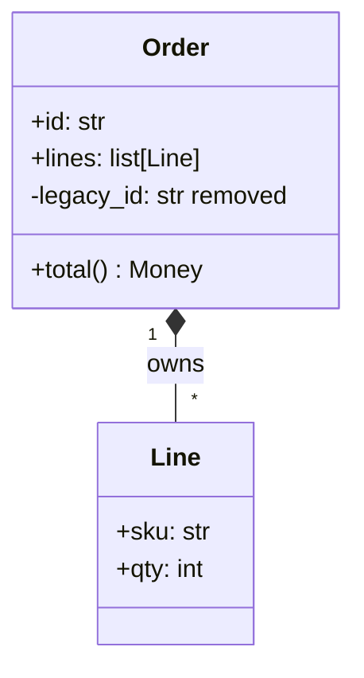
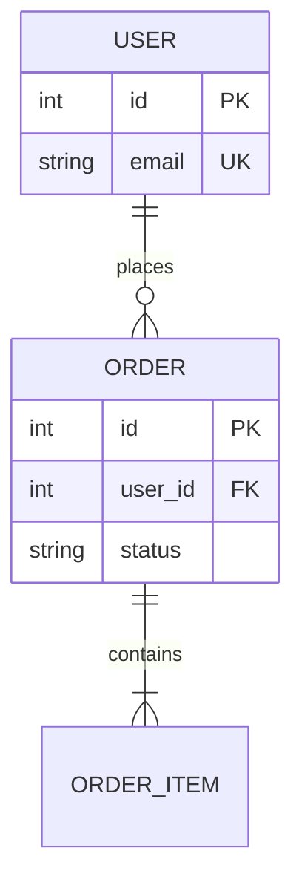
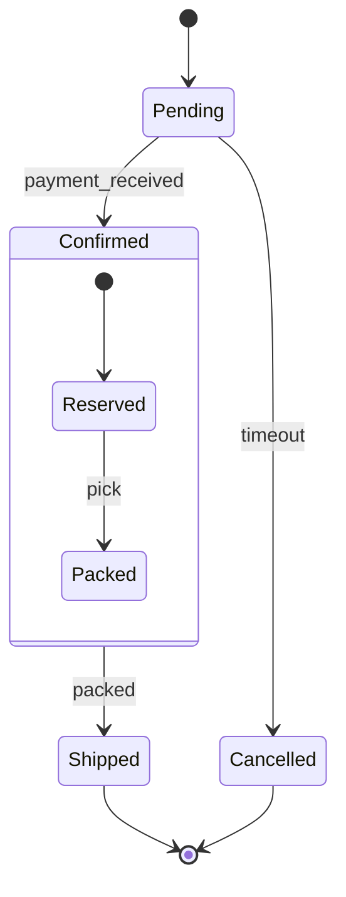

# Mermaid syntax for the five constructs

Condensed from [Agents365-ai/mermaid-skill](https://github.com/Agents365-ai/mermaid-skill) (MIT) to the types [`diagrams.md`](diagrams.md) uses. Read the section for the type you are drawing.

## Flowchart: bird's-eye, module map, change map, blast radius

| Direction | |
|---|---|
| `LR` | left to right: flows |
| `TB` | top to bottom: dependencies, callers above callees |

| Node | Syntax | Use for |
|---|---|---|
| Rectangle | `[text]` | module, function |
| Rounded | `(text)` | process step |
| Diamond | `{text}` | decision |
| Cylinder | `[(text)]` | database, store |
| Subroutine | `[[text]]` | external system |
| Circle | `((text))` | start, end |
| Flag | `>text]` | async event |

| Arrow | Syntax | Use for |
|---|---|---|
| Solid | `-->` | call, data |
| Dashed | `-.->` | optional, async, failure |
| Thick | `==>` | the main path |
| X end | `--x` | termination |
| Line | `---` | relation without direction |

Labels: `A -- "OrderCreated" --> B` or `A -->|"D3: retry"| B`. Fan-out: `A & B --> C`, `C --> D & E`. Node ids are bare words; put the display text in brackets and quote it when it holds `:`, `(`, `[`, `|`, `/`.

Styling: `classDef new stroke:#2e7d32,stroke-width:2px` then `class Foo,Bar new`.

## Sequence: ground-level flows, before-and-after

Declare `participant`s (box) and `actor`s (stick figure) in the order they act; the alias after `as` is the display text.

| Arrow | Use for |
|---|---|
| `->>` | call |
| `-->>` | return |
| `-x` | failure, fire and forget |
| `-)` | async message |

`+` after the arrow activates the target, `-` deactivates: `C->>+S: req` then `S-->>-C: res`. Or `activate S` / `deactivate S` as lines.

Fragments, one level deep at most:

Notes: `Note right of S: text`, `Note over A,B: text`.

## Class: data shapes, data types changed

Fields are `<visibility><name>: <Type>`; a member with `()` renders as a method. Text after the type renders as-is, so `+retries: int added` works as a mark. Visibility: `+` public, `-` private, `#` protected, `~` package.

| Relation | Meaning |
|---|---|
| `<\|--` | extends |
| `*--` | owns (composition) |
| `o--` | has (aggregation) |
| `-->` | uses |
| `..>` | depends on |
| `..\|>` | implements |

Cardinality in quotes on either side: `Order "1" --> "1..*" Line`. Values: `1`, `0..1`, `*`, `1..*`, `n..m`. Styling as in flowchart: `classDef` then `class Order changed`.

## ER: schema changes

| Left | Right | Meaning |
|---|---|---|
| `\|\|` | `\|\|` | one to one |
| `\|\|` | `o{` | one to zero or many |
| `\|\|` | `\|{` | one to one or many |
| `o\|` | `o{` | zero or one to zero or many |

Attribute line: `<type> <name> [PK|FK|UK] ["comment"]`.

## State: lifecycles

`[*]` is start and end. `A --> B : guard` puts the guard on the transition. `state Name { … }` nests, one level at most.
